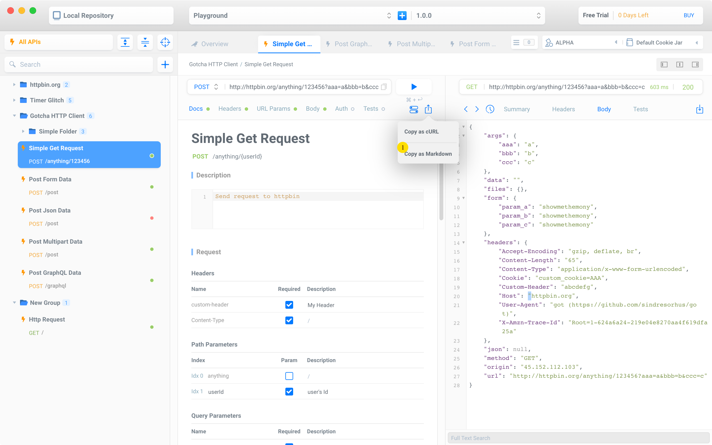

<p align="center">
  
</p>

# Gotcha HTTP Client - MacOS独占的HTTP接口测试工具

Gotcha HTTP Client是一个用于发送HTTP请求和查看返回信息的测试工具，UI设计简约，交互方便易于上手。使用过程中无需联网，所有数据均存放在本地。

Gotcha HTTP Client is a lightweight http client that allows you to make requests and inspect responses. It has pretty UI/UX design, and very easy to use. Gotcha is a standalone software and can be used without NETWORK.

Gotcha HTTP Client并非开源软件，本仓库用于BUG跟踪和问题反馈。

Gotcha HTTP Client is not open source, you can report any bugs or features here.

- [README_EN](README_EN.md)

**Follow my twitter for latest news !!!** [Twitter](https://twitter.com/whitecosm0s)


## 目录

- [最新版本](#最新版本)
- [下载地址](#下载地址)
- [收费方式](#收费方式)
- [技术支持](#技术支持)
- [功能列表](#功能列表)
- [使用指南](#使用指南)

### 最新版本 1.4.4 (2022/04/4)

功能优化
​
1. 自动保存功能优化，关闭Tab页或者发送请求后均会自动保存数据
2. 接口增加请求状态提示
3. URL栏中新增直接复制URL按钮
4. 请求右上角新增布局调整菜单，点击即可调整request/response视图的布局

BUG修复

1. 修复历史记录中URL过长时，展示异常的问题
2. 修复多个请求同时等待时，计时器计数异常的问题
3. 修复Split View拖动时的样式问题

### 下载地址

[Mac App Store](https://apps.apple.com/cn/app/gotcha-http-client/id1524200727)

### 收费方式

Gotcha HTTP Client是一个买断制应用，一次购买，终身更新。

- 提供**14天**免费试用
- **78元**购买永久版本

### 技术支持

遇到问题请提交ISSUE，或加入以下群聊与我沟通。
 
- 微信交流群


- QQ交流群


### 功能列表

以下为Gotcha HTTP Client支持的功能清单，未完成的功能会标注为**开发中**

 1. Url编辑
 
 - 支持复制curl到Url编辑栏，直接导入curl
 - 支持编辑Path和Query参数
 - 支持添加自定义HTTP请求方法
 
 2. 支持的请求体类型
 
 - Text 模式，支持多种语法高亮
 - JSON 模式，支持通过剪切板和文件导入JSON
 - Form 表单上传(form-urlencoded)
 - Multipart 文件上传
 - Binary格式**(开发中)**
 - GraphQL 请求

 3. Header 和 Cookie
 
 - 支持常用Header类型自动提示
 - 支持添加和删除自定义Cookie
 - 支持自动接收和发送Cookie
 - 多CookieJar切换和管理
 
 4. 接口认证
 
 - 支持 HTTP Basic Auth
 - OAuth 2.0 **(开发中)**
 - Digest Auth **(开发中)**
 
 5. 导入和导出
 
 - 支持导入Postman Collection文件
 - 支持通过文件或URL导入Swagger/OpenAPI文件，替代SwaggerUI
 - 支持通过Java项目直接生成API文档，支持Spring/SpringFox/JAX-RS框架
 - 支持导出单个请求到curl
 - 支持填写参数注释，并导出请求为Markdown格式的接口文档
 
 6. 环境变量
 
 - 支持环境变量和环境变量分组
 - 支持全局变量
 
 7. 为请求参数添加注释
 
 - 支持为请求参数添加注释
 - 支持保存返回响应作为文档示例
 - 支持导出Markdown格式的接口文档
 
 8. 返回响应断言和校验
 
 - 支持对响应Headers设置断言
 - 支持对Json格式的响应体设置断言
 
### 使用指南

#### 创建项目

> Gotcha启动后会生成一个默认项目"Playground"，你可以在该项目中测试各项功能。


1. 点击打开项目创建和导入面板
2. 新建空白项目，你可以在项目中自由创建或导入HTTP请求
3. 导入OpenAPI/Swagger文件，查看接口文档，目前不可编辑
4. 通过URL方式导入OpenAPI/Swagger文件
5. 通过Java项目生成接口文档，支持Spring/JAX-RS框架，目前不可编辑

#### 接口与分组管理

> Gotcha中的分组和请求之间可以随意排列和嵌套


1. 在根目录创建请求或分组，也可以导入Postman Collection文件
2. 使用右键菜单
	- 在请求上点击'New Request'或'New Group'，会创建在相邻位置
	- 在分组上点击'New Request'或'New Group'，如果分组为**展开状态**，则会作为子项目创建，如果分组为**收起状态**，则会在相邻位置创建。
	- 剪切与复制也遵循上述规则
3. 拖动改变接口与分组的排列方式或层级结构
	- 使用**Command**快捷键多选，**Shift**快捷键可以连选，支持批量拖动
	- 当分组为**收起状态**时，拖动位置会区分为**里侧**和**外侧**，里侧会放置对象到目标分组内部，外侧则放置在相邻位置
	
#### 编辑URL参数

> Gotcha通过参数化URL的模式可以让你直接编辑其中的每一部分


1. HTTP请求方法选择，点击菜单中的'+'按钮可以编辑自定义请求方法
2. URL编辑栏，支持直接导入**cURL**，过去使用过的URL会出现自动提示
3. Path编辑器，支持编辑任意一段Path参数
4. Query参数编辑
5. 对于参数较长的情况，可以打开一个独立的编辑页面

#### 编辑Header和Cookie

> Gotcha中可以直观的看到当前会发送的Cookie信息


1. Header的编辑和URL参数是一样，也会提示常用的Header
2. Cookie编辑器会显示当前域名下存在的Cookie，也可以手动添加
3. 通过右上角的Cookie Jar管理页面，可以添加多个Cookie Jar，用于模拟多用户的情况

#### 编辑Body请求体

> Gotcha支持几种常见的Body类型，并提供了一个独立的JSON编辑器

PS: 切换Body类型后，对应的Content-Type也会自动修改。

##### Text


1. 右下角可以选择文本模式，同时Content-Type也会对应变化，如果要改为其它类型，需要到Header页面手动修改

##### Json

使用Json编辑器的优势

- 无需处理格式和符号问题，例如忘记删除逗号
- 支持选择性发送某些值
- 支持拖动改变节点排列顺序和层级结构，交互模式与**接口管理**一致


1. 全部展开或全部收起节点
2. 预览JSON文本(只读模式)
3. 通过剪切板或文件导入Json
4. 选择节点类型 

##### Form


##### Multipart


1. 支持选择文本类型或文件类型

##### GraphQL类型


#### 参数注释

> Gotcha支持保存响应数据并作为示例导出

```
注意事项:

在Headers、Url Params、Body中填写的参数，会自动出现在Docs页面中，暂时无法直接修改
```

##### Header和Query参数


1. 参数名称
2. 是否必需填写
3. 参数注释

##### Path参数


1. 勾选Param选项后，可以指定某一段Path为参数，并且Index变为**可以编辑**的状态，填写参数名称
2. 指定Path参数后，上方的Path也会变为{{name}}的形式

##### 请求数据示例


1. Text和Json会导出为请求示例
2. Form和Multipart类型可以填写注释
3. 在返回响应中保存为响应示例

##### 导出为Markdown格式的接口文档



1. 点击'Copy as Markdown'即可

#### 使用环境变量与全局变量

> Gotcha通过表单的方式统一管理所有环境中的所有变量


1. 点击打开菜单，创建变量和新环境
2. 双击修改环境名称，拖动改变环境顺序，右键菜单删除环境
3. 在参数值中使用{{变量名}}即可引用环境变量

#### 使用Cookie Jar

> TODO

#### HTTP请求选项设置

> TODO 

#### 为返回响应设置断言

> TODO

#### 访问历史请求记录

> TODO


