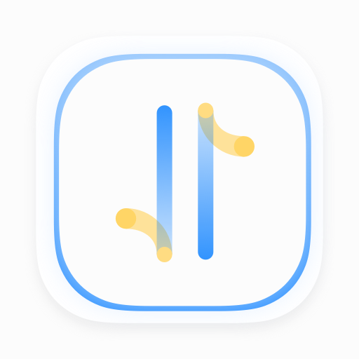

  

# Gotcha HTTP Client - A Ultimate API Develop Tool

Gotcha HTTP Client is a lightweight http client that allows you to make requests and inspect responses. It has pretty UI/UX design, and very easy to use. This is a standalone software and can be used without NETWORK.

Gotcha HTTP Client is not open source, you can report any bugs or features here.

## Menu 

- [Latest Version](#latest_version)
- [Download](#Download)
- [Purchase](#Purchase)
- [Features](#Features)
- [How to use](#usage)

### Latest Version (1.4.6) (2022/05/08)

New Feature

- Query parameters support choosing array type and format

UI/UX Optimize

- Replace 'Overview' tab with new home page
- Replace free icons with our own
- Export cURL support multipart and file
- Export cURL support resolving env and global variables
- Add 'Close to the Left' and 'Close to the Right' to tab's context menu
- Add 'Expand All' and 'Collapse All' options into Json Editor's context menu
- Add 'Rename' option to group and request's context menu
- Add response header's count display

BUG Fix

- Fix multiple cURL export problem
- Fix navigate to target not work when click tab
- Fix header's required status not checked problem

### Download

[Mac App Store](https://apps.apple.com/cn/app/gotcha-http-client/id1524200727)

### Purchase

 - We provide **14 days** free trial
 - $11.99 purchase full version
 
### Features

> TODO

### How to use

> TODO
